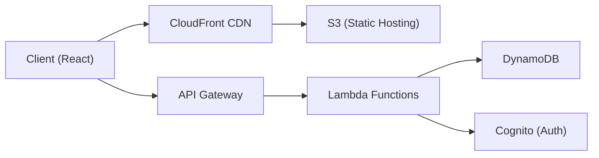
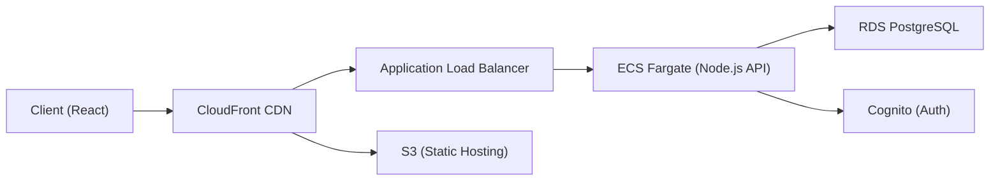
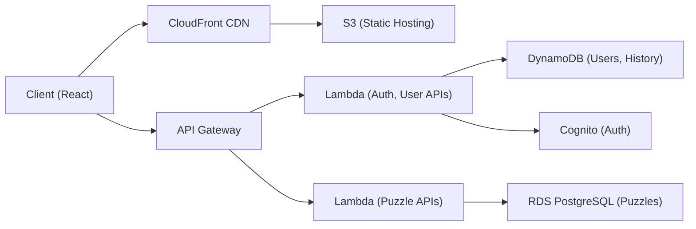

# Chess Puzzler — Project Plan

A responsive web application for solving chess puzzles, sourced from the [Lichess open puzzle database](https://database.lichess.org/#puzzles) (~5.7M puzzles, CC0 licensed).

---

## Data Source: Lichess Puzzle CSV

Each puzzle is a CSV row with these fields:

| Field | Description | Example |
|---|---|---|
| `PuzzleId` | Unique ID | `00sHx` |
| `FEN` | Board position | `q3k1nr/1pp1nQpp/...` |
| `Moves` | Solution moves (UCI) | `e8d7 a2e6 d7d8 f7f8` |
| `Rating` | Puzzle Elo | `1760` |
| `RatingDeviation` | Rating confidence | `80` |
| `Popularity` | Popularity score (0–100) | `83` |
| `NbPlays` | Times played | `72` |
| `Themes` | Space-separated tags | `mate mateIn2 middlegame short` |
| `GameUrl` | Source game on Lichess | `https://lichess.org/yyznGmXs/black#34` |
| `OpeningTags` | Opening classification | `Italian_Game Italian_Game_Classical_Variation` |

> [!IMPORTANT]
> The `Themes` field is our primary grouping mechanism. Themes include tactical motifs (`fork`, `pin`, `skewer`, `sacrifice`), game phases (`endgame`, `middlegame`, `opening`), piece types in endgames, mate patterns (`mateIn1`, `mateIn2`), and difficulty labels (`short`, `long`, `veryLong`).

---

## User Review Required

Please review the **AWS backend architecture options** below and let me know which direction you prefer (or a hybrid). Also consider:

> [!WARNING]
> **Key decisions needed:**
> 1. Which AWS architecture option do you prefer (A, B, or C)?
> 2. Do you want OAuth-only login (Google/GitHub) or also email/password?
> 3. Should we use the Lichess puzzle Elo ratings as-is, or compute our own per-user difficulty ratings?
> 4. Target database: DynamoDB (serverless-friendly) or PostgreSQL via RDS?
> 5. Frontend framework preference? (React/Next.js recommended for SSR + responsiveness)

---

## Functional Requirements

### 1. Puzzle Solving

- Interactive chessboard (drag & drop pieces)
- Validate moves against the solution sequence in `Moves`
- Visual feedback: correct/incorrect, hints, solution reveal
- Move animation and sound effects

### 2. User System

- **Authentication**: Sign up / login (OAuth + optional email/password)
- **Profile**: Username, avatar, stats dashboard
- **History**: Log of all attempted puzzles with result, time, date
- **Elo Rating**: Glicko-2 rating system (matching Lichess methodology)
  - User gains/loses rating per puzzle based on puzzle rating vs. user rating
  - Display rating chart over time

### 3. Puzzle Grouping & Filtering

Hierarchical categories derived from the `Themes` and `OpeningTags` fields:

```
Tactics
├── Fork
├── Pin / Unpin
├── Skewer
├── Discovered Attack
├── Sacrifice
├── Deflection / Attraction
└── ...

Checkmate Patterns
├── Mate in 1
├── Mate in 2
├── Mate in 3+
├── Back Rank Mate
└── ...

Endgames
├── Rook Endgame
├── Pawn Endgame
├── Queen Endgame
├── Bishop Endgame
├── Knight Endgame
└── ...

Openings
├── Italian Game
├── Sicilian Defense
├── French Defense
└── ...

Game Phase
├── Opening
├── Middlegame
└── Endgame
```

- Users can drill into categories and solve puzzles filtered by theme
- Track per-category progress and Elo

### 4. Additional Features

- **Daily puzzle**: Featured puzzle each day
- **Streak mode**: Solve consecutive puzzles without errors
- **Leaderboard**: Global and per-category rankings
- **Bookmarks**: Save puzzles for later review

---

## Non-Functional Requirements

- **Responsive design**: Mobile-first, works on all screen sizes
- **Performance**: Puzzle load time < 200ms, move validation instant (client-side)
- **Accessibility**: Keyboard navigation, screen reader support for board state

---

## AWS Backend Architecture Options

### Option A: Fully Serverless



| Component | Service |
|---|---|
| Frontend hosting | S3 + CloudFront |
| API | API Gateway + Lambda |
| Auth | Cognito |
| Database | DynamoDB |
| Puzzle storage | DynamoDB + S3 (bulk CSV) |

**Pros**: Zero server management, pay-per-use, scales to zero
**Cons**: Cold start latency, DynamoDB query flexibility is limited for complex filters

---

### Option B: Containerized (ECS Fargate)



| Component | Service |
|---|---|
| Frontend hosting | S3 + CloudFront |
| API | ECS Fargate (Node.js / Express) |
| Auth | Cognito |
| Database | RDS PostgreSQL |
| Puzzle storage | RDS + S3 |

**Pros**: Full SQL power for complex puzzle queries/filters, no cold starts
**Cons**: Always-on cost, more operational overhead

---

### Option C: Hybrid (Recommended)



| Component | Service |
|---|---|
| Frontend | S3 + CloudFront |
| Auth & User APIs | Lambda + DynamoDB |
| Puzzle APIs | Lambda + RDS PostgreSQL |
| Auth | Cognito |

**Pros**: SQL for rich puzzle filtering, DynamoDB for fast user/session data, serverless scaling
**Cons**: Two data stores to manage

---

## Frontend Architecture

| Layer | Technology |
|---|---|
| Framework | Next.js (React) with App Router |
| Chess board | `react-chessboard` + `chess.js` for logic |
| Styling | Vanilla CSS with CSS custom properties |
| State management | React Context + `useReducer` |
| Responsive | CSS Grid/Flexbox, mobile-first breakpoints |
| Animations | CSS transitions + Framer Motion |

---

## Data Pipeline

1. **Download** `lichess_db_puzzle.csv.zst` (~200MB compressed)
2. **Decompress** with `zstd`
3. **Parse & transform** CSV → structured records
4. **Load** into database (RDS or DynamoDB) with indexes on:
   - `rating` (for difficulty matching)
   - `themes` (for category filtering)
   - `openingTags` (for opening filtering)
   - `popularity` (for "best of" lists)

---

## Verification Plan

### Automated Tests
- Unit tests for move validation logic (chess.js integration)
- API integration tests against local DynamoDB/PostgreSQL
- E2E tests with Playwright for puzzle solve flow on desktop & mobile viewports

### Manual Verification
- Visual inspection of chessboard responsiveness across breakpoints
- User authentication flow testing (sign up → login → solve → check history)
- Puzzle category navigation and filtering accuracy
